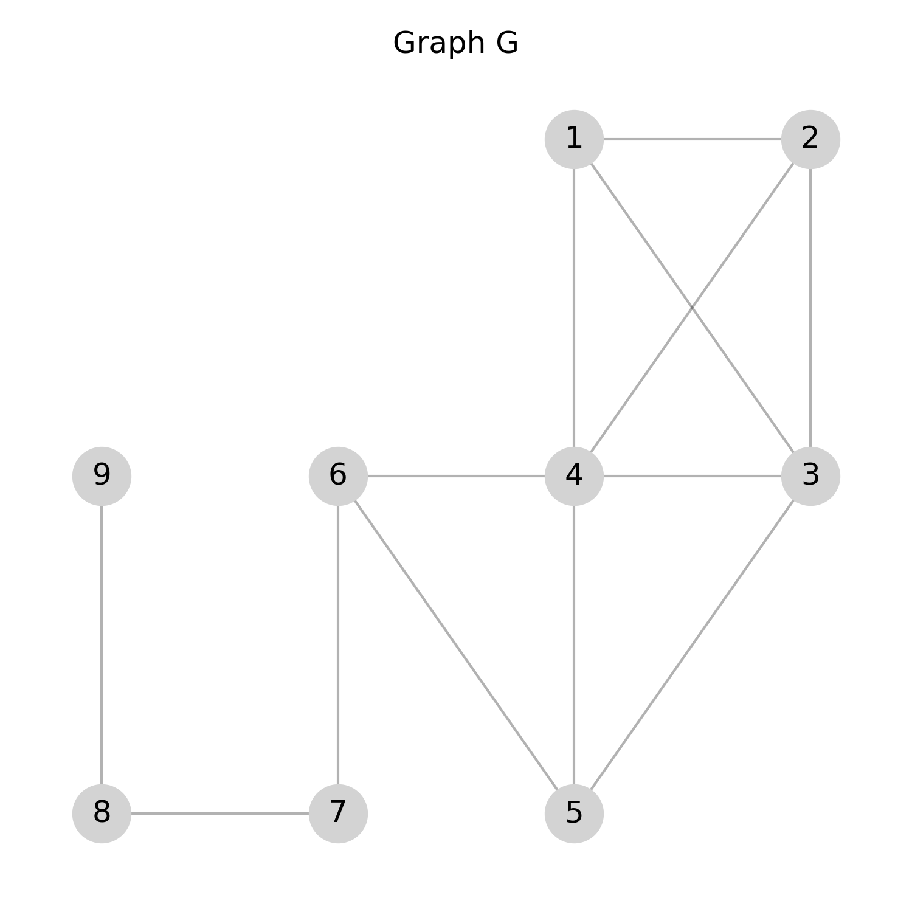
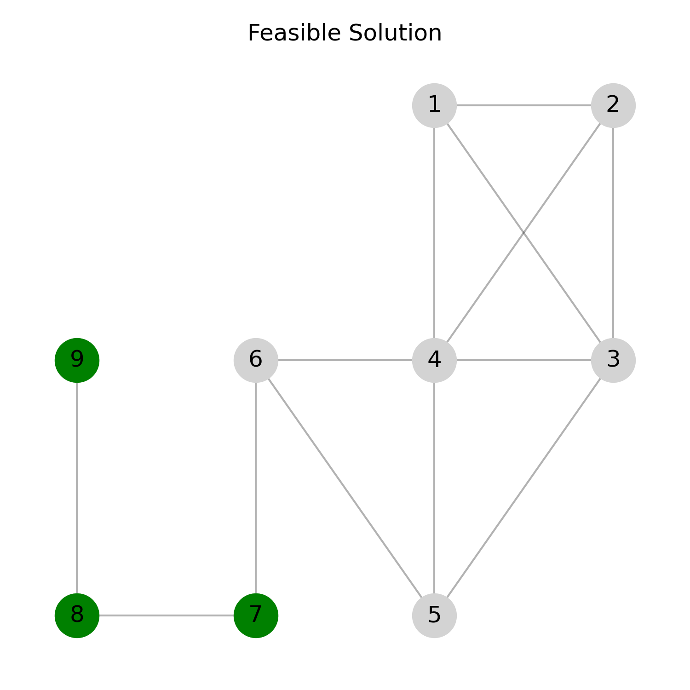
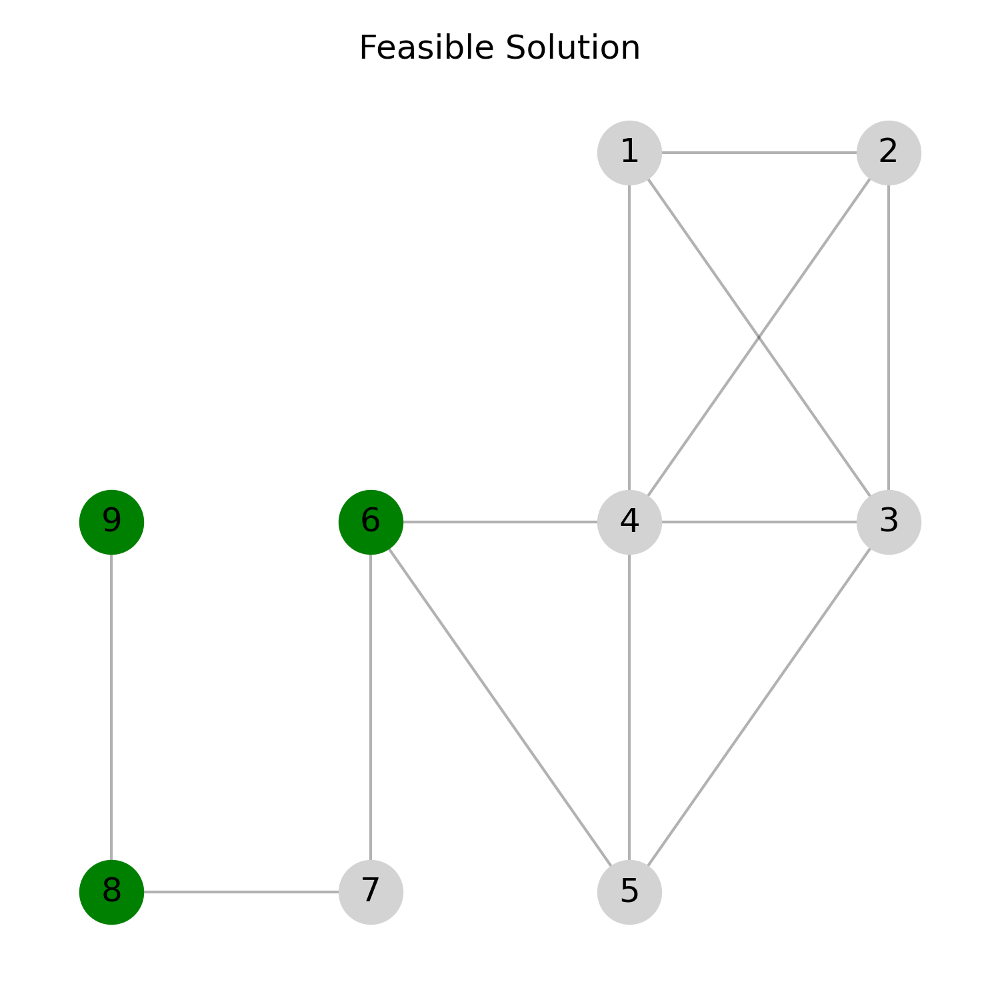
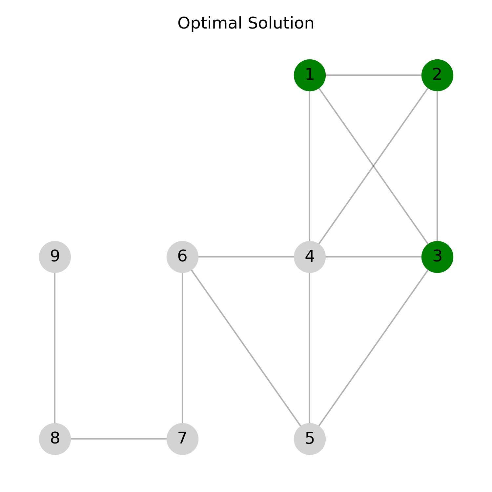

<!--
SPDX-FileCopyrightText: 2025 Daniela Scherer dos Santos <dssantos@dei.uc.pt>

SPDX-License-Identifier: CC-BY-4.0 
-->

# Densest k-Subgraph Problem

Daniela Scherer dos Santos and Luís Paquete, University of Coimbra, CISUC/LASI, DEI, Coimbra, Portugal  

Copyright 2025 Daniela Scherer dos Santos and Luís Paquete

This document is licensed under CC-BY-4.0.

## Introduction

The Densest k-Subgraph Problem (DKS) [1] is a combinatorial optimization problem that aims to identify a group of exactly $k$ vertices in a graph such that the induced subgraph contains the maximum number of edges. 

The problem is NP-hard [2] and has been studied in both theoretical and applied contexts. Applications include detecting dense communities in social networks and identifying protein complexes in biological networks.

## Task

Given a graph and a vertex cardinality $k$, the goal is to identify a subgraph with $k$ vertices and the maximum number of edges.

## Detailed description

Consider an undirected and simple graph $G = (V,E)$, where 
$V$ and $E$ are the vertex and edge sets of $G$, respectively. 
For a set of vertices $S \subseteq V$, we denote by 
$G_S=(S,E(S))$ the subgraph induced by $S$ in $G$.

Given $G$ and a positive integer $k \leq |V|$, the DKS problem consists of finding a subgraph $G_S$ induced by $S \subseteq V$ such that   

$$|E(S)|=\max \lbrace|E(S^\prime)| : S^\prime \subseteq V, |S^\prime|=k\rbrace$$

Note that $G$ may be unconnected.

## Instance data file

Each instance file represents an **undirected simple graph** in a format commonly used for real-life graphs (e.g. Matrix Market '.mtx' files) and also specifies the value of $k$. Its structure is as follows:

### Comments

* Lines starting with '%' are **comments**.
* They often contain metadata, descriptions, or source information about the graph.
* These lines should be ignored when reading the graph.

### Header

The first non-comment line contains three integers:

* **First number:** The value of $k$.
* **Second number:** Total number of vertices in the graph.
* **Third number:** Total number of edges in the graph.

### Edges

Each of the following lines represents an edge between two vertices. For example `1 2` indicates an edge between vertex 1 and vertex 2. Vertices are numbered consecutively from 1 to $|V|$.

## Solution file

The solution file describes the subgraph identified by the applied approach to solve the DKS problem. Its format is as follows:

* **First line:** An integer representing the number of vertices in the subgraph, which must equal the specified value of $k$.
* **Second line:** An integer representing the number of edges in the subgraph. This is the evaluation measure for the DKS problem.
* **Third line:** A list of vertex identifiers (integers) that belong to the subgraph. Each vertex should appear exactly once.

## Example

### Instance

```text
%%MatrixMarket matrix example
3 9 13
1 2
1 3
1 4
2 3
2 4
3 4
3 5
4 5
4 6
5 6
6 7
7 8
8 9
```

### Solution

```
3
2
7 8 9
```

### Explanation

The following figures illustrate the DKS problem for the example instance previously mentioned.

#### Original Graph G

This figure shows all vertices and edges in the input graph.



#### Feasible Solution

In the following figure, the subgraph induced by the green vertices corresponds to the **feasible solution** provided in the example for $k=3$. It contains 3 vertices and 2 edges.



Notice that the DKS problem does not impose any constraint on the connectedness of the solution subgraph. Therefore, a feasible solution can also be **unconnected**. 
The following figure shows such an example for the same input graph and $k=3$. It contains 3 vertices and only 1 edge.



#### Optimal Solution

In addition, the next figure illustrates an **optimal solution** for the instance, showing a subgraph with the maximum number of edges for the same $k=3$.



## Acknowledgements

This problem statement is based upon work from COST Action Randomised
Optimisation Algorithms Research Network (ROAR-NET), CA22137, is supported by
COST (European Cooperation in Science and Technology).

## References

[1] Corneil, D.G., Perl, Y., 1984. Clustering and domination in perfect graphs. *Discrete Applied Mathematics* 9, 27–39. [https://doi.org/10.1016/0166-218X(84)90088-X](https://doi.org/10.1016/0166-218X(84)90088-X)  

[2] Feige, U., Kortsarz, G., Peleg, D., 2001. The dense k-subgraph problem. *Algorithmica* 29, 410–421. [https://doi.org/10.1007/s004530010050](https://doi.org/10.1007/s004530010050)  

